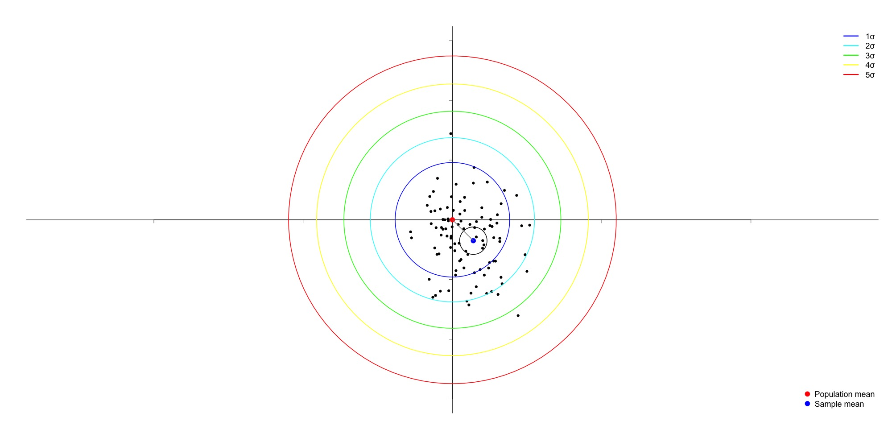

## Introduction

Covariance is a statistical measure of scatter. 
Let $X$ and $Y$ be random variables and let $x_i$ and $y_i$ be samples from each respective variable, then **population** covariance is calculated as

\begin{equation}
\rho_{x, y} = \sum_{i=1}^n \frac{(x_i - \bar{x})(y_i - \bar{y})}{n},
\end{equation}

whereas **sample** covariance is 

\begin{equation}
S_{x, y} = \sum_{i=1}^n \frac{(x_i - \bar{x})(y_i - \bar{y})}{n-1}.
\end{equation}

The discrepancy between coefficients $n$ and $n-1$ in the denominators, is a constant source of confusion. 
- Why do we need it?
- Why subtract one instead of an arbitrary value $a$?
- Why the correction is not present in the sample mean?

## Source of Bias

Sampling a standard normal distribution $\mathcal{N}(\mathbf{0}, \mathbf{\Sigma})$ may result in a sample with $\mathbf{\bar{x}} = \mathbf{0} + \mathbf{\epsilon}$, where $\mathbf{\epsilon} > 0$. Consequently, the sampled data points *lean* towards $\mathbf{\bar{x}}$ which yields smaller squared deviations $(\mathbf{x}_i - \mathbf{\bar{x}})^2$. Thus,  taking the average of squared deviations results in a biased estimator.

    

__Figure 1__. Multivariate standard normal distribution and skewed sample. Contours plotted for five standard deviations. 

## Proof of Bias

**Definition:**
An estimator $\hat{\theta}$ is biased, if the expected value of the estimate is not equal to the underlying value it is attempting to capture. More simply, let $\theta$ be the true parameter value, then
$\hat{\theta}$ is biased if
\begin{equation}
    \mathbb{E}[\hat{\theta}] \neq \theta.
\end{equation}

**Proof:** 
Computing the expected value of $S_{x, y}$ using $n$ in the denominator results in

$$
\begin{aligned}
    \mathbb{E}[S_{x, y}^2]
&= \mathbb{E}\!\Bigl[\frac{1}{n}\sum_{i=1}^n (X_i - \bar X)^2\Bigr]
= \frac{1}{n}\sum_{i=1}^n \mathbb{E}[(X_i - \bar X)^2] \\[6pt]
&= \frac{1}{n}\sum_{i=1}^n \Bigl(\mathbb{E}[X_i^2]
   -2\,\mathbb{E}[X_i\,\bar X]
   +\mathbb{E}[\bar X^2]\Bigr) \\[6pt]
&= \frac{1}{n}\sum_{i=1}^n \Bigl(\mathbb{E}[X_i^2]
   -\frac{2}{n}\sum_{j=1}^n \mathbb{E}[X_i X_j]
   +\mathbb{E}[\bar X^2]\Bigr) \\[6pt]
&= \frac{1}{n}\sum_{i=1}^n \Bigl(\mathbb{E}[X_i^2]
   -\frac{2}{n}\bigl(\mathbb{E}[X_i^2] + \sum_{j\neq i}^{n}\mathbb{E}[X_i X_j]\bigr)
   +\mathbb{E}[\bar X^2]\Bigr) \\[6pt]
&= \frac{1}{n}\sum_{i=1}^n \Bigl(\mathbb{E}[X_i^2] - \frac{2}{n}\bigl(\mathbb{E}[X_i^2] + \sum_{j\neq i}^{n}\mathbb{E} [X_i X_j]\bigr) + \frac{1}{n^2}\bigl(\sum_{i=1}^n \mathbb{E}(X_i^2) + 2\sum_{i\neq j}^n \mathbb{E}[X_i X_j]) \Bigr) \\[6pt]
&= \frac{1}{n}\sum_{i=1}^n \Bigl(\sigma^2 + \mu^2 
   -\frac{2}{n}\bigl(\sigma^2 + \mu^2 + (n-1)\mu^2\bigr)
   + \frac{1}{n^2} \bigl(n(\sigma^2 + \mu^2) + 2 \tfrac{n(n-1)}{2} \mu^2\bigr) \Biggr) \\[6pt]
&= \frac{1}{n} \sum_{i=1}^n \left(
    \sigma^2 + \mu^2 
    - \frac{2}{n} \bigl(\sigma^2 + n \mu^2 \bigr) 
    + \frac{1}{n^2} \bigl(n\sigma^2 + n \mu^2 + n(n-1) \mu^2 \bigr)
\right) \\[6pt]
&= \sigma^2 + \mu^2 - \frac{2}{n} \sigma^2 - \frac{2}{n} n \mu^2 + \frac{1}{n^2} (n \sigma^2 + n \mu^2 + n(n-1) \mu^2) \\[6pt]
&= \sigma^2 + \mu^2 - \frac{2}{n} \sigma^2 - 2 \mu^2 + \frac{1}{n} \sigma^2 + \frac{1}{n} \mu^2 + \frac{n-1}{n} \mu^2 \\[6pt]
&= \sigma^2 + \mu^2 - \frac{2}{n} \sigma^2 - 2 \mu^2 + \frac{1}{n} \sigma^2 + \mu^2 \\[6pt]
&= \sigma^2 - \frac{1}{n} \sigma^2 \\[6pt]
&= \frac{n-1}{n} \sigma^2.
\end{aligned}
$$

Thus, the sample covariance when averaging over $n$ is biased. Furthermore, using $n-1$ results in an unbiased estimator
$$
\begin{aligned}
    \mathbb{E}[S_{x, y}^2]
    &= \mathbb{E}\!\Bigl[\tfrac1{n-1} \sum_{i=1}^{n} (X_i - \bar{X})^2\Bigr]
    = \tfrac1{n-1} \,\mathbb{E}\!\Bigl[\sum_{i=1}^{n} (X_i - \bar{X})^2\Bigr] \\[6pt]
    &= \tfrac1{n-1} \,\bigl((n-1)\,\sigma^2\bigr)
    = \sigma^2.
\end{aligned}
$$

## Arbitrary correction

When we compute the sample means 
\begin{equation}
\bar{x} = \frac{1}{n} \sum^n_{i=1}x_i
\end{equation}
we introduce a constraint on the centered deviations $(x_i - \bar{x})$. Notice that:
\begin{equation}
\sum_{i=1}^n (x_i - \bar{x}) = \sum_{i=1}^n x_i - n\bar{x} = n\bar{x} - n\bar{x} = 0.
\end{equation}
So, the deviations sum to zero which *uses* a degree of freedom (DOF). Suppose we know $n-1$ of the deviations $d_1, d_2, d_3, \dots , d_{n-1}$, then the last one $d_n$ is no longer a free variable:
\begin{equation}
    d_n = -\sum^{n-1}_{i=1}d_i.
\end{equation}
Although there are $n$ deviations, only $n-1$ are independent. Dividing by $n$, would dilute the variance estimate since the sum of squared deviations does not represent $n$ independent draws from the population. 

## Uncorrected Sample Mean

Figure 1 reveals that the sample mean is skewed towards the sample, yet in the formula 
\begin{equation}
\bar{x} = \frac{1}{n}\sum^n_{i = 1}x_i,
\end{equation}
there is no correction. This seems contradictory, however, the correction is done due to the lost degree of freedom. In the sample mean, there are $n$ degrees of freedom (free variables $x_1, x_2, x_3, \dots , x_n$.)

## Gap in Rigor and Intuition

After studying a variety of proofs and explanations, there may still be a nagging sensation regarding this topic. It may be from the lack of rigor in the explanation regarding degrees of freedom—the definition of DOFs is quite handwavy. Consequently, it may lack the persuasiveness that the rigorous proof has. Yet, even the rigorous proof feels made out of whole cloth. Somehow, the answer was guesstimated instead of arrived at with mathematical rigor. 

So, why not $n - a$? As of current understanding:
- If $a = 1$, $S_{x, y}$ is unbiased.
- If $a \neq 1$, the estimator is biased: underestimates or overestimates. 

Previously, using $n$ in the denominator results in
\begin{equation}
    \mathbb{E}[S_{x,y}^2] = \frac{1}{n}\sum_{i=1}^n \mathbb{E}[(X_i - \bar X)^2] = \frac{1}{n}(n - 1)\sigma^2.
\end{equation}
So, to correct for this $\frac{1}{n}$ is simply swapped for $\frac{1}{n-1}$, to neutralize the $n - 1$ term. 

The explanation above may provide some ease of mind, however, the lingering emotion still remains about the missing piece of the puzzle.

    

**Figure 2**. The Gap Between Proof and Degrees of Freedom. 

Maybe the missing link is a *rigorous* definition for the degrees of freedom or something else entirely. It will be left to the future statisticians to find out. 

