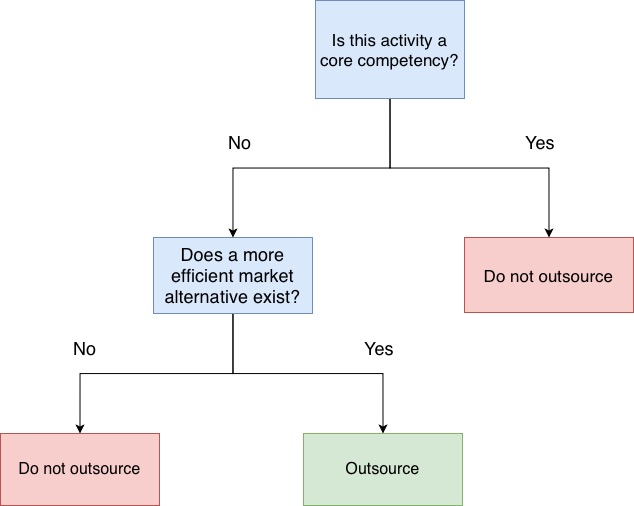

## Introduction

LLM-based tools, such as Claude Code or Codex, have become increasingly helpful with, e.g., coding or research. They can semi-autonomously run experiments, implement features and fix bugs. Whether they accelerate research or software engineering is still up for debate. Many researchers and engineers are nevertheless taking advantage of the tools in their work. And after taking up these tools, many people have begun to wonder, what should I use them for? 

The opportunities seem endless, while the results are dubious. More importantly, is there some part of the work that should be kept out of reach of LLM-based tools? 

## Operations Management

The answer to a similar queestion already exists in the operations management and economics literature: when should a firm outsource some activity? The article [@geyskens2006make] introduce the transaction cost economics (TCE) which assert that an activity should be outsourced when buying from the market is cheaper than coordinating the activity internally. In [@prahalad1990core] the authors take the resource-based view (RBV) where a firm should not outsource the resources that bring a sustainable competitive advantage. 

Subsequently, a combined view is taken by [@both2009]. The main conclusion is that neither perspective *alone* are sufficient. The author argues that both, RBV and TCE, are required. Initially, firms should consider whether an activity contributes to sustainable competitive advantage. If the answer to the previous question is no, then TCE-based decision can be employed to determine whether external providers can perform the activites more efficiently. The combined result is a perspective where non-core activites are outsourced with TCE and 
core competencies are kept in-house. 

<figure style="text-align: center;">
    
    <figcaption>Figure of a boolean decision tree for outsourcing that uses RBV and TCE.</figcaption>
</figure>

## The Extension

This analogy, I argue, extends to the individual. We accrue core competencies, e.g., through education or work experience, and we need
to make the decision about outsourcing. In fact, most of us make those decisions everyday. When making a payment with a bank account, you have effectively outsourced money management to the chosen bank. While depositing money in a bank is a no-brainer for many of us, a more pressing outsourcing decision has recently risen. Many people are wondering the extent they should be using LLM-based tools in their work.

A similar consideration should be employed:
1. Does this activity contribute to my core competencies that bring me sustainable competitive advantage?
2. Is there a market alternative that can perform this activity more efficiently?

For example, a researcher writing a paper could use Codex to format references and fix typos or summarise related work. However, hypothesizing research questions and interpreting results are important for developing scientific maturity and judgement, which are a part of the core competency of a researcher. Additionally, designing and implemeting experiments is a contentious topic. Many researchers give free hands to Claude Code or Codex to: design, run and evaluate hypotheses. This activity decrees the core scientific skills of researchers and thus should not be outsourced. 

The aforementioned displays the real difficulty in applying this to real-life: deciding the activites that are core competencies.

## The Evidence

From a business perspective, many organizations have prospered by keeping core competencies and considering transaction economics. Of course there are other relevant decisions and factors in successful business and distinguishing the driving ones can be difficult, nevertheless many firms have effectively employed the RBV- and TCE-based approaches. For example, 
