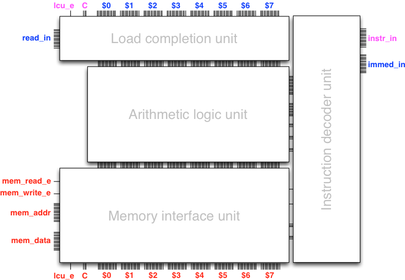
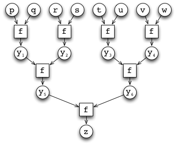
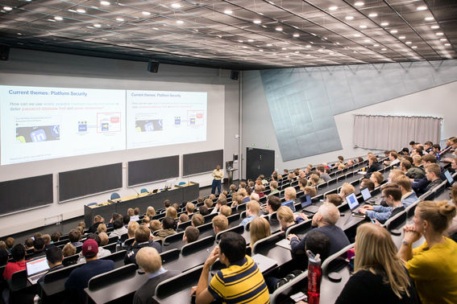
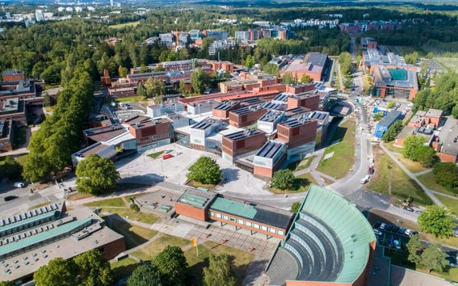

## Introduction
In this course, it was our pleasure and privilege to introduce the students to many of the central principles of computing and programming, to the computer as a machine, and to programming paradigms that enable them to virtualize and scale up their computations all the way to industrial-scale infrastructure, if they so choose. 

During the course we teach:
    1. Bits and data
    2. Combinational logic
    3. Sequential logic, state and feedback
    4. A programmable computer
    5. Collections and functions
    6. Efficiency
    8. Recursion
    9. Concurrency and parallelism
    10. Machines that learn?

  

*The course goes in depth into runtimes, computer architecture and the frontiers of computer science.*

Assignments and an exam is how students are graded. Each week there are weekly programming assignments in Scala about one of the 10 topics listed above. 
There are also rigorous mathematical proofs and concepts to help the students formalize their learning. 


*Description of the Transitivity of big-O notation and some definitions regarding them.*

Mainly however, the course is about the students learning to think like a computer scientist and express their thoughts in a way that a computer can understand.
The assignments are written in Scala with propietary architectures and libraries that we have developed for the course. The course has weekly lectures and labs everyday for almost 8 hours a day.

This course is one of the biggest courses in the department and is a requirement for all students in the computer science and data science programs. Every year it has 600 - 800 students. So, you can imagine the scale of the course – during the first lectures there are usually not even enough seats for everyone, so some people end up standing. 

 

*Picture of the lecture room in less capacity than the course usually has...*

Below is an implementation of a `binary search` algorithm in Scala, which was used in the course to teach the students about the efficiency of algorithms and the importance of data structures – although there is a separate Data Structures and Algorithms course that runs every autumn semester. It uses an abstract `Ordering[T]` to compare arbitrary types `T`, however, it is merely a simple example and the real assignments are much more challenging (not to mention the exam). 

```scala
def binarySearch[T](s: IndexedSeq[T], k: T)(using Ordering[T]) : Boolean =
  import math.Ordered.orderingToOrdered // To use the given Ordering
  //require(s.sliding(2).forall(p => p(0) <= p(1)), "s should be sorted")
  def inner(start: Int, end: Int): Int =
    if !(start < end) then start
    else
      val mid = (start + end) / 2
      val cmp = k compare s(mid)
      if cmp == 0 then mid                     // k == s(mid)
      else if cmp < 0 then inner(start, mid-1) // k < s(mid)
      else inner(mid+1, end)                   // k > s(mid)
    end if
  end inner
  if s.length == 0 then false
  else s(inner(0, s.length-1)) == k
end binarySearch
```

The assignemnts are usually crafted such that online tools and resources can help with collecting information required, but the student has the responsibility to understand and implement the solution by combining the pieces of information they have gathered.

# References

1. Programming 2 notes (Petteri Kaski, Tommi Junttila, and Lukas Ahrenberg 2013-2024) at [https://a1120.cs.aalto.fi/2024/notes/](https://a1120.cs.aalto.fi/2024/notes/)
