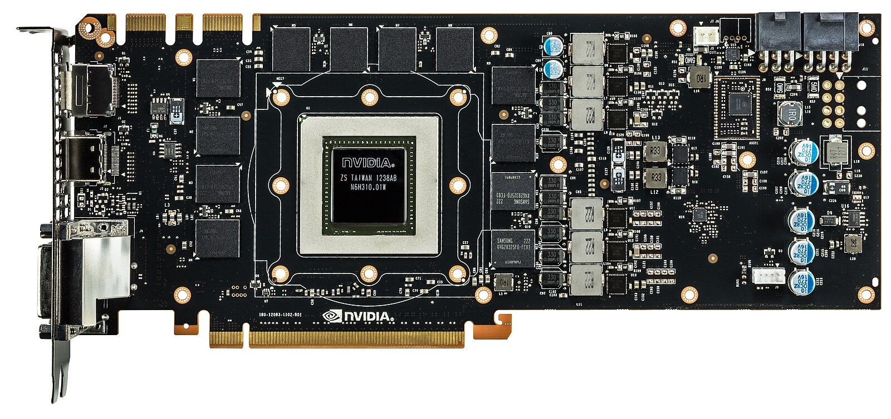
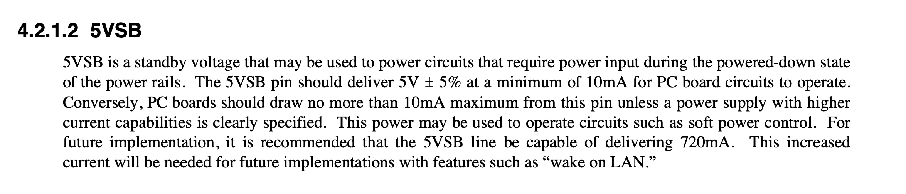

## Inception

When I was twelve years old, I built my first computer with the help of my dad. It had an Intel Core i7-4770 that I immediately overclocked—and still keep overclocked to this day. It had two sticks of 8 GB RAM and a GTX 780 plugged into an ASUS Z87. All of these components cost around 1700€ back in 2013, when GPUs were mainly for gaming—AlexNet [@10.5555/2999134.2999257] released one year prior to this in ILSVRC 2012 [@russakovsky2015imagenet].

<figure style="text-align: center;">
  
  <figcaption>GTX 780 PCB without a heatsink.</figcaption>
</figure>

We used an SSD that had 256 GB and installed Windows 7 on it. Throughout the years, it was upgraded to Windows 8.1 and then subsequently to Windows 10 which I did not use 
a great deal because I had adopted a MacBook as my day-to-day computer by that point. Consequently, the desktop laid dormant, until recently. 

## Brainwave

I got into CUDA programming through the course [Programming Parallel Computers](https://ppc.cs.aalto.fi), where we used remote desktops at Aalto to program the GPUs. I did not want to use Windows remotely, because I am familiar with Unix-like commands, so I installed Ubuntu. To unlock remote usage, I still had to configure remote access from a separate network, which was easily configured by ```SSH``` keys.

With the OS installed and access setup, a normal server would be all set, however, I wanted my computer to run on demand with Wake-on-LAN (WoL) using ```wakeonlan```. While WoL does not require Power over Ethernet, it does require the network interface controller to run on the power supply's standby voltage. Initially, I tried setting the session to suspend through ```systemctl suspend``` but the wake up would only succeed within a short interval subsequent to suspending the server. After some digging, I found out that the network interface controller (NIC) runs on residual current for a short period ($\approx$ 5-10 minutes).

<figure style="text-align: center;">
  
  <figcaption>ATX specification explicitly mentioning standby voltage for features such as WoL in February 1997 [@atx].</figcaption>
</figure>

Since suspending the machine effectively disables remote access after a short period of time, I could either: keep the machine running at all times or figure out a method to power it on and off remotely. This functionality can be facilitated with an embedded device, I had an old RaspberryPi lying around. 

## Solution


